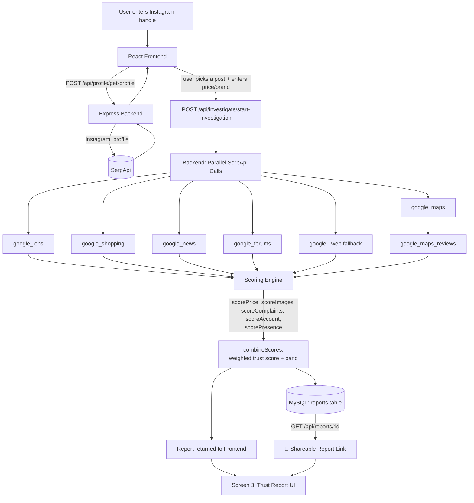

<div align="center">

# 🛡️ TrustLens

### A 60-second, evidence-backed trust check for Instagram sellers

*Built for SerpApi India Hackathon 2026 — Knowledge & Public Interest Track*

TrustLens checks an Instagram shop's trust before you pay — stolen product photos, inflated prices, scam complaints, and seller legitimacy, all backed by live evidence links. Built for the SerpApi India Hackathon 2026 (Knowledge & Public Interest track).


</div>

---

## 🧩 The Problem

Every day, thousands of Indian shoppers buy from Instagram shops — small sellers with no storefront, no reviews platform, and no easy way to verify if they're real. Stolen product photos, inflated prices, and fly-by-night accounts cost real people real money, and there's no quick way to check before paying.

## 💡 What TrustLens Does

Paste a seller's Instagram handle and the product you're considering. In under a minute, TrustLens investigates like a detective across **8 SerpApi engines** and returns a single trust score (0–100) with a risk band — backed by real, linked evidence for every claim.

| Signal | What it checks |
|---|---|
| 💰 **Price Fairness** | Is the asking price in line with real market listings, or is it a bait-pricing trap? |
| 📸 **Photo Originality** | Are the product photos original, or stolen from known dropshipping/resale sites? |
| 🚩 **Complaints** | Does the brand show up in news, forums, or the web alongside scam-related language? |
| 👤 **Account Health** | Follower/following ratios, verification status, scam phrases in captions |
| 📍 **Store Presence** | If a physical address is claimed, is it real — and what do actual customer reviews say? |

## ✨ Features

- **5-signal trust scoring** across price, photos, complaints, account health, and physical presence
- **Graceful handling of missing data** — if a signal can't be checked (e.g. no address claimed), it's excluded and weights renormalize, never penalizing a seller for data that isn't available
- **Evidence-backed, not just a verdict** — every signal shows the real numbers behind it (market median price, review counts, match counts), not a black-box label
- **Persisted reports** — every investigation is saved to MySQL with a permanent ID
- **🔗 Shareable report links** — every report gets a unique URL (`/report/:id`) that can be copied and sent to anyone (family, friends) so they can see the exact same trust report instantly, without re-running the investigation
- **Clean, focused 3-screen flow** — search → pick a product → see the verdict, with no account creation or login required

## 🏗️ System Architecture



### How it works, step by step

1. **Profile lookup** — the seller's Instagram handle is fetched via `instagram_profile`, returning bio, followers, verification status, and recent posts
2. **Investigation** — once a product post and price are selected, the backend fires 6–8 SerpApi calls **in parallel** (`Promise.allSettled`, so one failed call never breaks the whole investigation)
3. **Scoring** — each signal is scored 0–100 independently by a dedicated pure function; missing data returns `null` rather than a fake score
4. **Combination** — `combineScores()` computes a weighted average across only the signals that returned data, renormalizing weights so confidence is always honestly reported
5. **Persistence** — the final report is saved to MySQL with a UUID, enabling it to be fetched again later via `GET /api/reports/:id`
6. **Sharing** — that same UUID powers a shareable report link (`/report/:id`) on the frontend, so a saved report can be reopened and shown to anyone, not just the person who ran the check

## 🔗 Shareable Reports

Every completed investigation generates a permanent link:
```
https://your-deployed-url.com/report/<report-id>
```
Clicking **"Copy share link"** on any report copies this URL. Opening it — on any device, at any time — fetches the saved report from MySQL and renders the exact same trust score and evidence, so a warning or a green light can be forwarded directly, e.g. over WhatsApp, before a family member makes a purchase.

## 🛠️ Tech Stack

| Layer | Technology |
|---|---|
| Backend | Node.js, Express, MySQL (`mysql2`) |
| Frontend | React (Vite), Tailwind CSS |
| Data | SerpApi (official `serpapi` Node SDK) |

## 📁 Project Structure

```
TrustLens/
├─ server/
│  ├─ app.js                     — Express app entry point
│  ├─ config/db.js               — MySQL connection pool
│  ├─ routes/                    — profile, investigate, report routers
│  ├─ controllers/                — request handlers
│  ├─ services/serpApiService.js — all 8 SerpApi engine calls
│  ├─ utils/scoring.js           — the scoring engine (5 signal scorers + combiner)
│  ├─ models/report.js           — MySQL read/write for reports
│  ├─ scripts/setupDb.js         — one-command DB + schema setup
│  └─ schema.sql
├─ frontend/
│  └─ src/                       — React components for all 3 screens
└─ docs/
   └─ FRONTEND_SPEC.md           — the spec written before frontend development
```

## ⚙️ Setup Instructions

### Prerequisites
- Node.js v24+ (tested on v24.12.0)
- MySQL Server running locally (or any reachable MySQL instance)
- A SerpApi account and API key → https://serpapi.com

### 1. Clone the repo
```bash
git clone https://github.com/AryanKanade/trustlens.git
cd trustlens
```

### 2. Backend setup
```bash
cd server
npm install
cp .env.example .env
```
Edit `server/.env` with your real credentials:
```
PORT=5000
SERPAPI_KEY=your_actual_serpapi_key
DB_HOST=localhost
DB_USER=root
DB_PASSWORD=your_mysql_password
DB_NAME=trustlens
```

Create the database and tables in one command:
```bash
npm run setup-db
```

Start the backend:
```bash
npm run dev
```
Runs on `http://localhost:5000` — confirm you see `Server is running on port 5000` and `MySQL connected`.

### 3. Frontend setup
In a new terminal:
```bash
cd frontend
npm install
cp .env.example .env
```
`frontend/.env` defaults correctly for local dev:
```
VITE_API_BASE_URL=http://localhost:5000
```

Start the frontend:
```bash
npm run dev
```
Open the URL shown (typically `http://localhost:5173`).

### 4. Try it
1. Enter a public Instagram handle
2. Pick a product post from their grid
3. Enter the asking price, a product/brand search term, and optionally the claimed store address
4. Click **Run trust check** — takes 5–10 seconds (multiple SerpApi calls run server-side)
5. View the trust score, band, and evidence per signal — then copy the share link to send it to anyone

## 📡 SerpApi Usage

| Engine | Role |
|---|---|
| `instagram_profile` | Seller bio, followers, verification, recent posts |
| `google_lens` | Detects stolen/resold product photos |
| `google_shopping` | Real market price comparison |
| `google_news` | Scam-related news mentions |
| `google_forums` | Scam-related forum discussions |
| `google` (web search) | Fallback complaint search across the wider web |
| `google_maps` | Verifies a claimed physical store location |
| `google_maps_reviews` | Real customer reviews for that location |

All calls happen server-side via the official `serpapi` Node.js SDK (`server/services/serpApiService.js`) — never exposed to the client.

## ⚖️ Disclaimer

TrustLens provides an automated risk estimate based on public data. It is **not** a legal verdict. Always verify independently before purchasing from any seller.

## 🤖 AI Tools Used

- **Claude (Anthropic)** — used as a planning and code-review partner throughout backend development. All backend code (routes, controllers, the SerpApi service layer, the scoring engine, MySQL persistence) was written, debugged, and tested personally by the developer; Claude explained concepts, caught bugs, and suggested fixes that were then implemented and verified manually via Postman.
- **Antigravity** — an AI coding agent used to build the frontend UI (React + Tailwind), guided by a detailed specification (`docs/FRONTEND_SPEC.md`) written in advance defining the exact API contract, screen flows, and visual direction. Every feature was reviewed and tested against the working backend before being accepted.

Full responsibility for all submitted code is taken by the developer, who understands and can explain or modify any part of it.